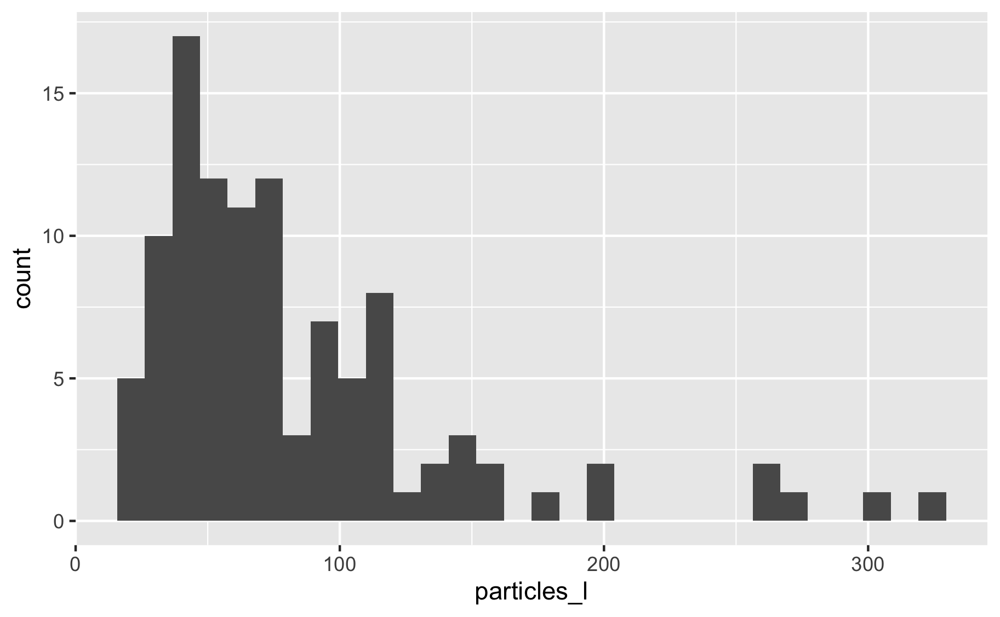
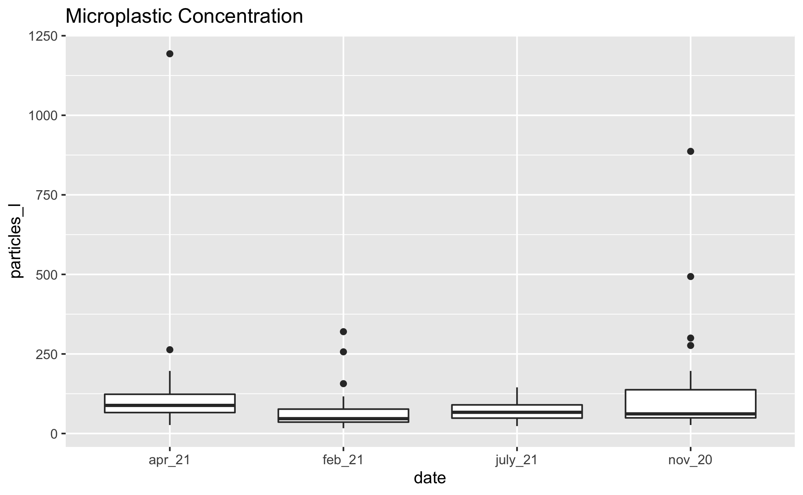
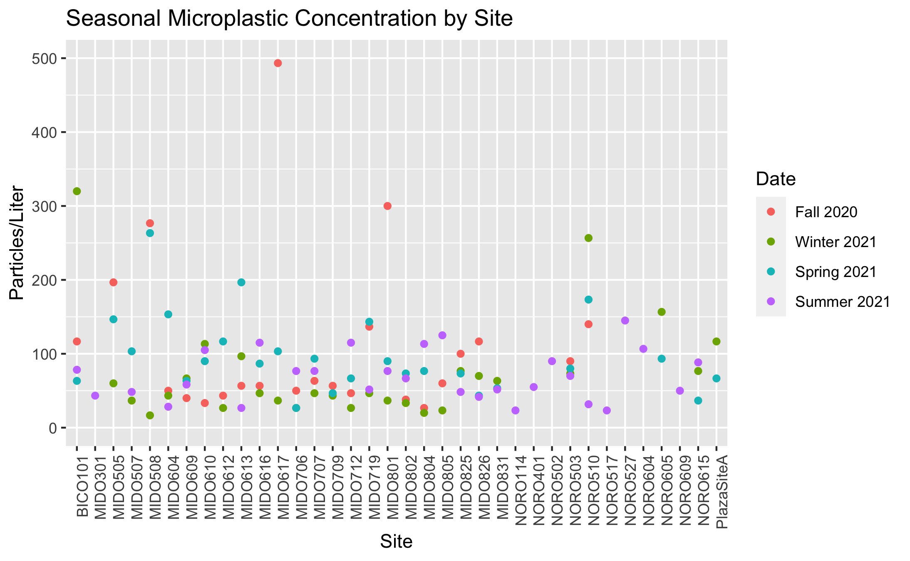
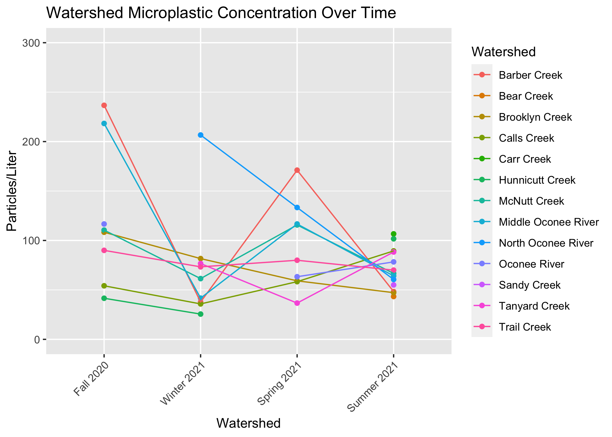
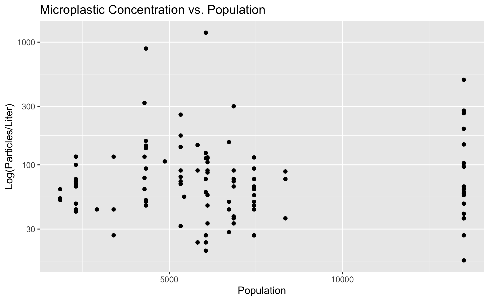
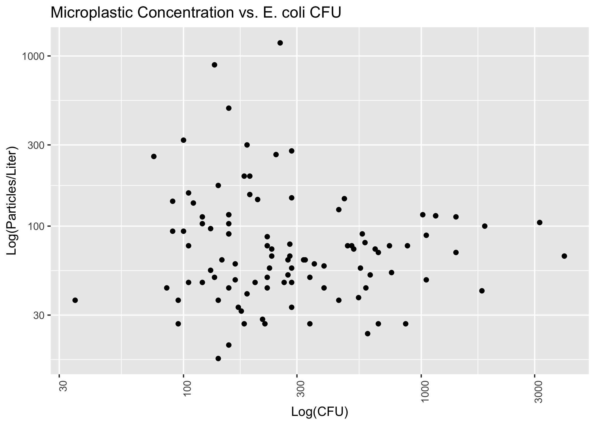
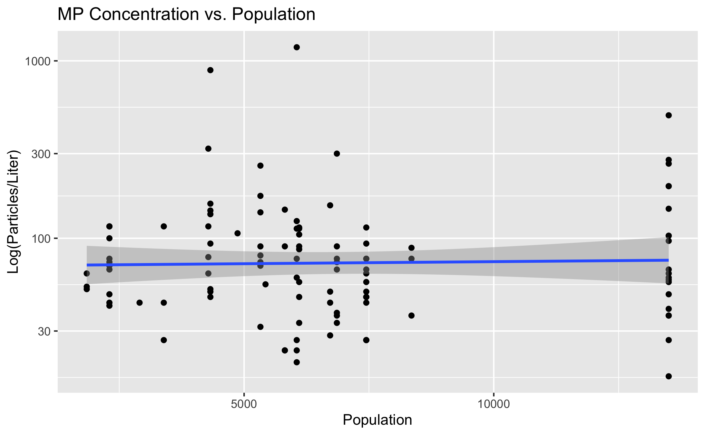
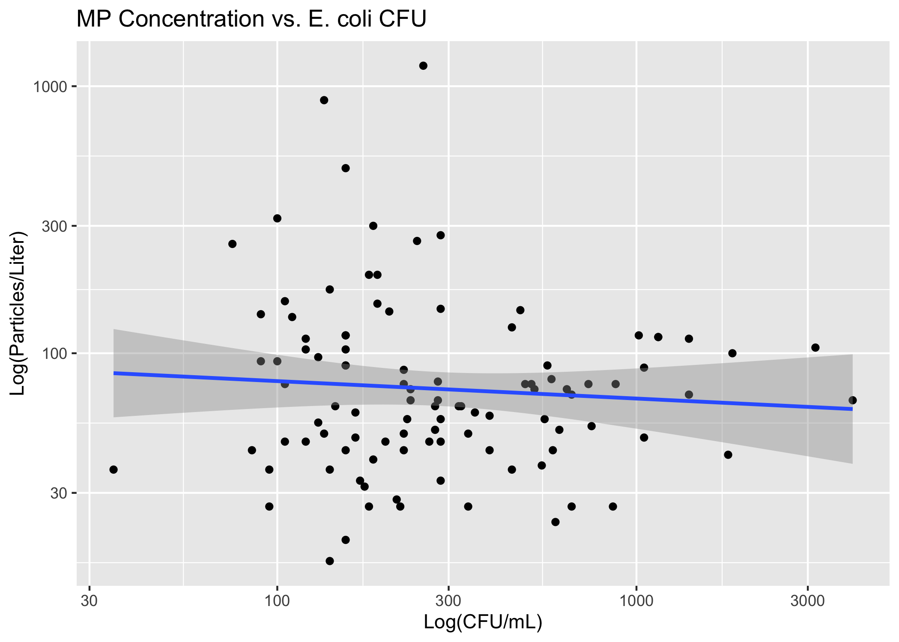
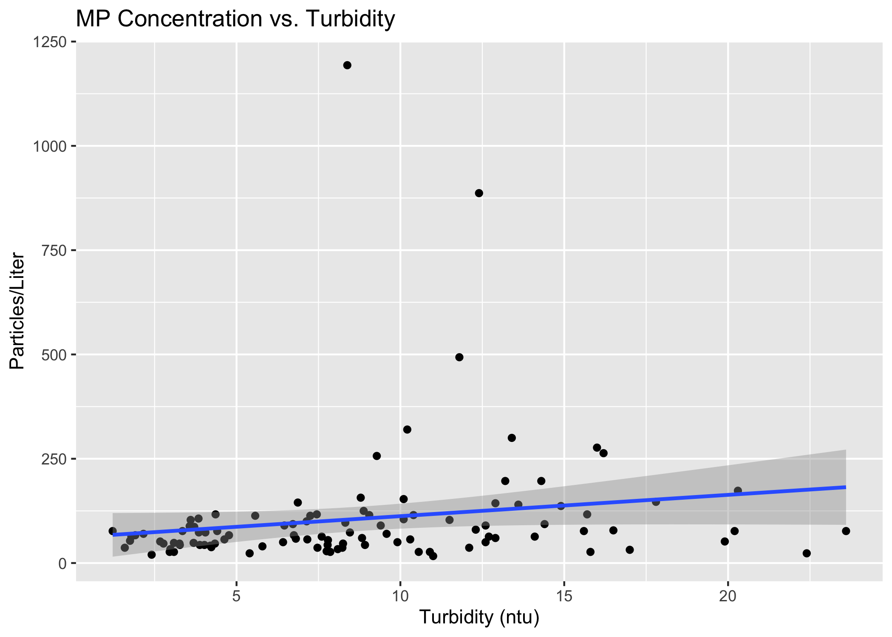
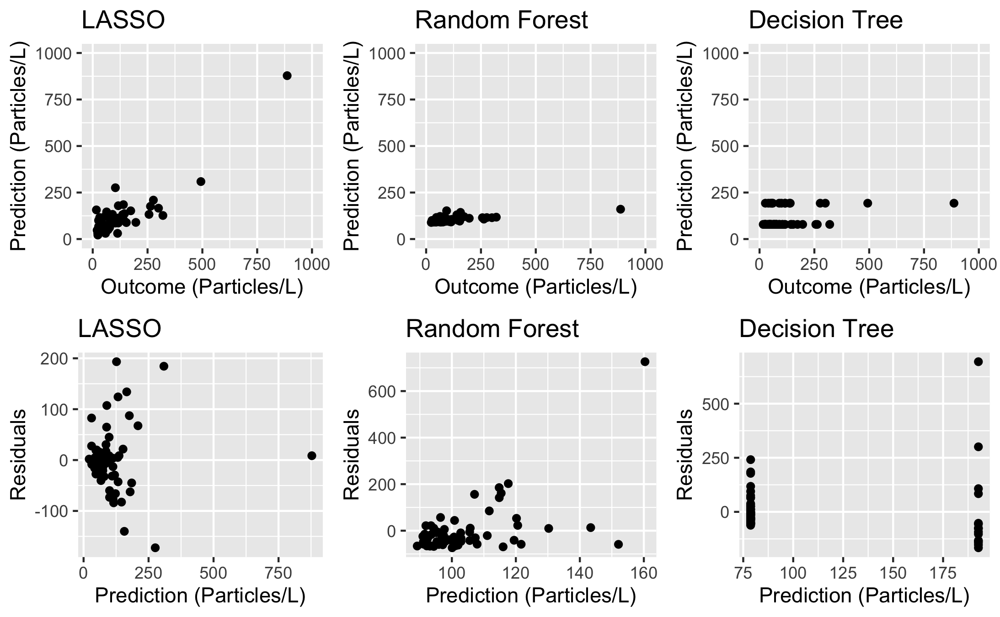

# Abstract
With growing awareness of plastic pollution and its detrimental environmental impacts, there has been increased attention on the study of microplastics. These small debris result from the weathering and breakdown of plastic waste from urban runoff, agricultural runoff, ocean dumping, stormwater, waste management, and other sources. Microplastics pose a threat to both aquatic life and human health due to their chemical makeup, their build-up in the environment, and their suspected long-term biological effects. As their ubiquity becomes more apparent, so does the need for accessible, affordable, and effective methods for the widespread study and quantification of microplastic pollution.
 
This study takes place in Athens, GA, an urban area which houses a population of about 127,000. The project relies on local volunteer citizen science efforts for water sampling, processing, and analysis. Given the local and regional ecological significance of the Oconee River—including its transport of freshwater to the Atlantic Ocean—this study aims to collect relevant data regarding microplastics in the Upper Oconee Watershed, which includes 2 rivers and 15 creeks in Athens-Clarke County.
 
Through community-based sample collection and analysis, volunteers quantified microplastics through membrane filtration and visual identification. Preliminary data consistently show that local freshwater microplastic levels are greater than the U.S. average in the Upper Oconee Watershed, a portion of the Oconee River basin with both a high population size and high population density relative to other regions of Georgia. Average and median concentrations of 95 particles/L and 46 particles/L, respectively, were recorded throughout one year of seasonal sampling. Further visual and statistical analysis will confirm the project’s results, and discussion of these results in context will reveal the efficacy of this community-based approach to the quantification of microplastics. 


# Introduction 

## Background
In the past two decades, the study of microplastics has expanded exponentially. Since the earliest paper mentioning small plastic particles in the ocean was published in the 1970s, before the term “microplastics” even existed, researchers across the globe have quantified microplastic particle levels in both marine and freshwater environments, assessed potential drivers and predictors of microplastic pollution, examined the presence of microplastics in the food chain, and explored the potential human health impacts of ingested microplastics [@Carpenter1972]. Though the body of research on microplastics has grown in recent years, many knowledge gaps remain regarding this pollutant. The term microplastics was first coined in 2004, and today microplastics are defined as plastic particles smaller in size than 5 mm, though some studies examine particles as large as 20 mm [@Thompson2004]. Years of sampling, experimentation, and progress in research methods tell researchers that microplastics are a persistent class of pollutant and are found worldwide in a diverse assemblage of forms [@Barboza2018].

### Pollution Sources
Microplastics are classified by source as either primary or secondary. Primary microplastics are those which are originally manufactured as microplastics, such as microbeads; primary microplastics are often found in personal care products, industrial scrubbers used for cleaning, plastic powder used for molding, and virgin resin used in plastic production (EFSA, 2016). Secondary microplastics begin as larger plastics and degrade into smaller pieces as the result of exposure to environmental stressors (e.g. sunlight, wind, water) (Murphy et al., 2016). For example, secondary microplastics occur when ultraviolet light exposure catalyzes photo-oxidation in plastic, leading to brittle pieces that are even more likely to break down (Wright & Kelly, 2017). A secondary microplastic source that is less obvious than the fragmentation of plastic debris is synthetic clothing. Clothes made of fibers such as nylon, polyester, rayon, or spandex shed microfibers during washing cycles; these fibers are later deposited into the environment through wastewater treatment plant effluent (Murphy et al., 2016). Most experts in the field agree that secondary microplastics are the most significant contributor to microplastic pollution, though a broad range of microplastic sources are recognized (Tibbetts et al., 2018). Researchers recognize wastewater treatment plant (WWTP) effluent as a major vector for both primary and secondary microplastics, and therefore WWTP effluent has been one area of focus in microplastics literature (Murphy et al., 2016; McCormick et al., 2016; Li et al., 2018, Tibbetts et al., 2018, Harrison et al., 2018). A team of scientists in Scotland examined WWTPs as a source of microplastics in the aquatic environment by sampling for microplastics at different stages of wastewater treatment; the team calculated a 98% reduction of microplastics from influent to effluent (Murphy et al., 2016). While an efficient removal rate, Murphy and collaborators estimate that 65 million microplastics are still released from the plant daily due to the large volume of effluent. Numerous other studies have evaluated WWTP effluent in relation to microplastic concentration as well (McCormick et al., 2016; Li et al., 2018, Tibbetts et al., 2018, Harrison et al., 2018). 
Other predictors of microplastics particle concentration that researchers consider include land use (i.e. natural, agricultural, industrial, developed, forest & woodland, etc.) and population (total size, density, dwellings) (Tibbetts et al., 2018; Barrows et al, 2018; Townsend et al., 2019; Yonkos et al, 2014). Compared to the ocean, freshwater is the dominant source of microplastic due to land-based industrial and domestic pollution (Luo et al., 2019). Rivers transport both point-source and diffuse pollution to the ocean, contributing an estimated 1.15 to 2.41 million tons of plastic waste annually (Lebreton et al, 2017). Factors including anthropogenic impact, pollution sources, and hydrodynamics affect the rate of microplastic accumulation and transport (Luo et al., 2019; CITE). Researchers continue to focus on identifying the variables influencing microplastic concentration in present day research (CITE).

### Ecological Consequences
Despite their small size, microplastics have significant and quantifiable impact on aquatic ecosystems (CITE). Since microplastics permeate both marine and freshwater environments, aquatic animals easily mistake the particles for food and ingest them, allowing the pollutant to accumulate in their bodies; studies have shown that organisms ingest microplastics either by accident or by mistaking them for food (Wright & Kelly, 2017; Carbery, O’Connor, & Palanisami, 2018, Tanaka & Takada, 2016). Microplastics have been identified in the digestive tracts of fish and birds of prey, in mussels and other bivalves, and in natural populations of a crustacean species (Tanaka & Takada, 2016; Carlin et al., 2020; van Cauwenberghe & Janssen, 2014; Devriese et al., 2015; Murray and Cowie, 2011). Microplastics are dangerous to organisms due to the physical accumulation of the particles themselves, and because they act as a transport mechanism for toxic chemicals in three main ways: (1) the plastic itself is toxic, (2) the plastic adsorbs and later releases environmental pollutants, and (3) the plastic leaches chemical additives (Mato et al, 2001; Bouwmeester et al., 2015). The hydrophobic surface and high surface area to volume ratio of microplastics causes the adsorption and concentration of organic pollutants such as polychlorinated bisphenols (PCBs), dichlorodiphenyldichloroethylene (DDE), and nonylphenol (NP) (Wright & Kelly, 2017; Carbery, O’Connor, & Palanisami, 2018). Evidence of trophic transfer of microplastics through the food chain suggests that microplastics and the toxins that accompany them pose a threat to aquatic life further up the food chain, and to human health through consumption of seafood (Barboza et al 2018, Carbery et al, 2018).


### Relevance
Through decades of research, the scientific community proves that microplastics are ubiquitous, having identified microplastics in oceans, rivers, lakes, and other water bodies across the globe, including remote mountain lakes, the bottom of the ocean, and in ocean sediments offshore of Antarctica [@Free2014;@Waller2017;@Peng2018]. Modeling of current and future plastic production and pollution indicates that plastics are so pervasive that they have been considered as a geological indicator of the proposed Anthropocene era [@Zalasiewicz2016]. These models also suggest that microplastic concentrations will only increase in the future [@Geyer2017;@Barboza2018;@Prokic2019;@Everaert2018]. In a 2018 paper, Barboza and collaborators state that the increase in environmental microplastics is particularly concerning due to the contaminants’ small size, the limited technology for quantifying their presence, and their potential for adversely affecting both marine biota and humans [@Barboza2018]. Further, research shows that microplastic pollution is largely due to land-based sources; ocean-based sources such as commercial fishing, vessels, and other activities, contribute only 20% of the total plastic debris, while terrestrial activity contributes the other 80% of pollution in the marine environment [@Andrady2011;@Li2018]. Microplastics with various terrestrial origins mainly enter the marine environment via rivers, releasing most microplastics to the ocean and retaining some in freshwater systems [@Free2014;@Li2018;@Browne2010;@Lebreton2017]. However, a majority of microplastics research to date has focused on marine settings rather than freshwater, indicating that more studies are required in this area [@Besseling2017;@Dris2015]. Examining freshwater systems as the dominant source of microplastics will lead to a better overall understanding of microplastics pollution input and therefore insight into the scale of the issue and mitigation strategies [@Lebreton2017].

### Present Research
	This preliminary study sought to identify the presence of microplastics in the Upper Oconee Watershed, estimate the levels of microplastic pollution present in the freshwater systems of Athens, GA, observe temporal changes and trends, and explore the relationship between microplastic pollution and hypothesized predictors including population level, land use, and wastewater treatment plant proximity (CITE – who hypothesizes this?). We hypothesized that microplastics would be present in the Upper Oconee Watershed, that levels would be greater in more highly-trafficked areas with greater anthropogenic impact, and that microplastic pollution would correlate to other indicators of water quality (CITE). 


## Description of data and data source

The data that I am using for this project is from my personal undergraduate research project on freshwater microplastics in Athens, GA. The study is ongoing and was conducted in collaboration with the Upper Oconee Watershed Network (UOWN) via their quarterly sampling events. There is one year’s worth of quarterly data, with the following sample dates: November 2020, February 2021, April 2021, and July 2021. The data include variables such as sample site, latitude and longitude, watershed location, and duplicate A and B counts of microplastics observed per filter. For the most recent sampling date, July 2021, there is additional data where a second counting session was performed, in order to assess the comparability of parallel counts. There are about 136 observations of ~10 variables in total in the dataset. The independent variables – site location, coordinates, watershed location, etc – were retrieved from UOWN. Values for microplastic counts were recorded based on visual identification via a dissecting microscope, performed by myself and by a small team of <10 volunteers.

## Questions/Hypotheses to be addressed
The questions that I want to answer with this data include the following:
 - Can we characterize microplastics in Athens, GA using a citizen science approach? 
 -	What are the levels of microplastics like in Athens, GA overall? 
 -	How do microplastic levels differ based on location within the region? 

Questions that I want to answer that will require gathering more data using coordinates/watershed info include:
 -	Is microplastic concentration impacted by local land use? 
 -	Is microplastic concentration impacted by localized population levels in specific neighborhoods?
 -	Does wastewater treatment plant effluent from nearby facilities increase microplastic concentration at affected sites?
 -	Are microplastic levels correlated to bacteria levels measured at the same sites? 
These questions also relate to hypothesized predictors of microplastic pollution: population level, land use, wastewater treatment plant effluent, and microbial water quality. 

# Methods

## Data aquisition
_As applicable, explain where and how you got the data. If you directly import the data from an online source, you can combine this section with the next._

### Description of study area
The Upper Oconee Watershed is located in Northeast Georgia, spanning from Gainesville on the northern end to Lake Sinclair in Milledgeville, Georgia, on the southern end. The Upper Oconee Watershed encompasses 7590 km2, and includes more than 4000 km of streams [@Fisher]. Land within the Upper Oconee Watershed is historically agricultural, but has been subject to increasing urbanization in the past two decades; the study area contains developed and densely populated urban residential areas [@Cho; @Fisher]. The Oconee Watershed is one of 14 river basins in the state of Georgia; the Oconee River feeds into the Altamaha River, which eventually deposits into the Atlantic Ocean off the Georgia coast (source: UOWN website). The Oconee River begins where the North and Middle Oconee Rivers meet, south of Athens, Georgia. The North and Middle Oconee Rivers begin in Lula, GA, and Brassleton, GA, respectively. 

The Upper Oconee Watershed is regularly monitored by the Upper Oconee Watershed Network (UOWN), an Athens-based monitoring, education, advocacy, and recreation organization. Quarterly sampling events occur throughout the year, and the present research project was made possible via collaboration and eventual partnership with UOWN and the quarterly sampling events. The UOWN study area consists of 600 km2.

### Experimental design: sample collection and processing
1-liter grab samples of water were collected quarterly from Fall 2020 through Summer 2021, in November, February, April, and July by UOWN community members. Samples were collected from 25 to 30 sites on each sampling date. The number of sites was decreased from previous sampling events due to COVID-19 public health restrictions with volunteers. 

Samples were processed via vacuum filtration, which was performed in 150 mL volumes in duplicate for each site. Samples were pumped through gridded 0.45 micron membranes (Whatman) and immediately covered and stored covered in plastic petri dishes at room temperature for up to 8 weeks. 
Filters were visually inspected using a dissecting microscope with magnification ranging from [INSERT]. Microplastic particles were identified based on the following characteristic features: unnatural homogenous color, unnatural shape, homogenous texture, homogenous width (no tapered end) (CITE). Microplastic concentration (No/L) was calculated by dividing the total microplastic particle count by the sample volume. Duplicates (samples A and B for each site) were averaged to obtain a singular concentration value for each sample site. 

### Controls
To evaluate contamination in the lab, blank filters were used to gauge airborne contamination and contamination within processing methods. Blank filters were placed in uncovered petri dishes on each work bench during sample filtration and processing. DI and MilliQ water were filtered in 150 mL volumes, in duplicate, to produce controls to represent potential contamination from filtration processes. The average contamination per sample was = INSERT. 

## Data import and cleaning

Since I am performing importing and cleaning in a separate document, in this section I will provide an overview of my steps/methods for wrangling the data, without actual code in this section. 

To supplement my analysis, additional data was imported as detailed below. 

### UOWN Quarterly Data
Public data from Upper Oconee Watershed Network, Athens, Georgia; retrieved from www.uown.org
### Population
NHGIS [@Mansen]
### Land Cover
NHGIS [@Mansen]
### Water Reclamation Facilities
Coordinates for Athens-Clarke county's three water reclamation facilities: North Oconee, Middle Oconee, and Cedar Creek were manually located via Google Maps.

## Exploratory analysis

This section will contain the key products of my exploratory analysis (located in exploration.Rmd) when complete. Since I am keeping this document in manuscript style, I will keep processing/exploration/analysis code separate. 

Table \@ref(tab:summarytable) shows a table summarizing the data.
```{r summarytable,  echo=FALSE}

#summarytable=readRDS("../../results/summarytable.rds")
#knitr::kable(summarytable, caption = 'Data summary table.')

#I eventually want a nice looking summary statistic table. This is a place holder for now  
```

### Distribution of Microplastic Concentration

Figure \@ref(fig:distribution) shows a histogram of microplastic concentration observations. The minimum concentration is 16.67 particles/L and the maximum is 1193.33 particles/L. The mean concentration is 104.39 particles/L, and the median is 66.67 particles/L. 

```{r distribution,  fig.cap='Distribution of Microplastic Concentration', echo=FALSE}

```

Microplastic concentrations remained in similar ranges throughout the study period. Figure \@ref(fig:concentrationbydate) shows a boxplot of concentrations by sample date. 

```{r concentrationbydate,  fig.cap='Particles/L by Sample Date', echo=FALSE}

```

There is some seasonal variation in concentration at each individual site. Figure \@ref(fig:seasonalconc-bysite) shows a plot of concentrations at each site. 

```{r seasonalconc-bysite,  fig.cap='Seasonal Variation in Particles/L', echo=FALSE}

```

Figure \@ref(fig:watershed-overtime) shows a line graph of the mean watershed microplastic concentrations at each seasonal sampling date. 

```{r watershed-overtime,  fig.cap='Microplastic Concentration Over Time', echo=FALSE}

```

### Predictors
Population, land cover/use, and bacteria levels are hypothesized predictors of microplastic concentration. Figure \@ref(fig:logparticlesvpop) and Figure \@ref(fig:logmpvcfu) demonstrate the relationship between microplastic concentration and population and microplastic concentration and bacteria levels (CFU/L), respectively. 

```{r logparticlesvpop,  fig.cap="Particles/L vs Population", echo=FALSE}

```

```{r logmpvcfu,  fig.cap='Log particles/L vs CFU', echo=FALSE}

```

## Full analysis

Preliminary modeling reveals that there is not a strong relationship between microplastic concentration and population level. Figure \@ref(fig:m-logconcvpop) demonstrates a linear model fit. 

```{r m-logconcvpop-no-outlier,  fig.cap='Concentration vs Population Linear Model', echo=FALSE}

```

Figure \@ref(fig:m-logconcvcfu) shows a linear model of microplastic concentration vs CFU (both variables log-transformed). 

```{r m-logconcvcfu,  fig.cap='Concentration vs CFU Linear Model', echo=FALSE}

```

Figure \@ref(fig:concvturbidity) demonstrates a linear model of particles/L vs turbidity.

```{r m_concvturbidity,  fig.cap='Concentration vs Turbidity Linear Model', echo=FALSE}

```

Table \@ref(tab:lmfittable) shows a table summarizing a linear model fit predicting particles/L with 6 predictors. 

```{r lmfittable,  echo=FALSE}
lm_fit_table=readRDS("../../results/lm_fit_table.rds")
knitr::kable(lm_fit_table, caption = 'Linear model fit table.')
```

Beyond the basic linear model, we have applied additional methods to improve model performance, including LASSO regularization and building decision trees and random forests for model comparison. The predictions, outcomes, and residuals resulting from each type of plot are demonstrated in Figure \@ref(fig:model-grid)

```{r model-grid, fig.cap='Model Quality', echo=FALSE}

```


# Results

# Discussion
This exploratory pilot study demonstrates the presence of freshwater microplastic pollution in the Upper Oconee Watershed and makes an initial attempt to quantify the level of pollution throughout this region of Athens, GA. At the start of this project, there was little to no existing research on microplastics in Athens. Therefore, the data resulting from this study establish the presence of microplastics in the area [mention support of other studies showing MP in urban vs rural areas]. 

Overall, concentration levels were found to be higher than expected based on some previous studies of regional freshwater microplastic pollution. However, the body of research on microplastics as a whole reflects mixed evidence of concentrations. Recorded levels in the literature range from 1 or fewer particles per liter at some sites to greater than 1000 particles per liter at others. There is growing evidence that microplastic pollution in permeates ecosystems in unexpected, supposedly pristine regions across the globe; one study found between 22 and 117 particles per liter in the Antarctic, demonstrating that microplastic particles are being found in places you would never expect. 
## Variation of Microplastic Concentration
Limitations to the scope of this project include that it was designed as a student-led pilot with minimal funding. Visual identification via dissecting microscope was the method used due to its simplicity and accessibility; visual identification is used in most baseline microplastic studies, but can be up to 70% inaccurate and therefore is usually accompanied by spectroscopy technology which allows chemical identification of suspected microplastic particles and increasing the accuracy of quantification results. 

This year-long pilot study is followed by a continued partnership with the Upper Oconee Watershed Network, who will continue sampling for microplastics quarterly through citizen-science volunteer efforts. Areas of focus for the future include furthering temporal data collection, refining quantification methods, observing the relationship between microplastic levels and other water quality indicators, and exploring other hypothesized water quality predictors. 
While limited in scope, this study provides valuable initial data on the presence of microplastics in the region and establishes a basis for continued and refined research on the growing subject of freshwater microplastics. 


## Summary and Interpretation
_Summarize what you did, what you found and what it means._

## Strengths and Limitations
_Discuss what you perceive as strengths and limitations of your analysis._

## Conclusions
_What are the main take-home messages?_


# References


