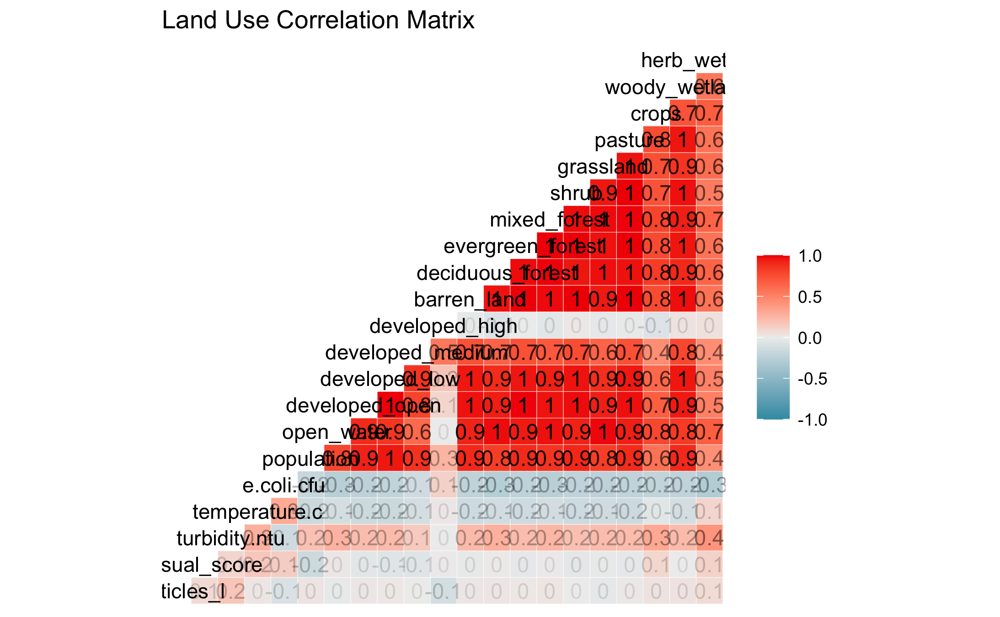

# Abstract
With growing awareness of plastic pollution and its detrimental environmental impacts, there has been increased attention on the study of microplastics. These small debris result from the weathering and breakdown of plastic waste from urban runoff, agricultural runoff, ocean dumping, stormwater, waste management, and other sources. Microplastics pose a threat to both aquatic life and human health due to their chemical makeup, their build-up in the environment, and their suspected long-term biological effects. As their ubiquity becomes more apparent, so does the need for accessible, affordable, and effective methods for the widespread study and quantification of microplastic pollution.
 
This study takes place in Athens, GA, an urban area which houses a population of about 127,000. The project relies on local volunteer citizen science efforts for water sampling, processing, and analysis. Given the local and regional ecological significance of the Oconee River—including its transport of freshwater to the Atlantic Ocean—this study aims to collect relevant data regarding microplastics in the Upper Oconee Watershed, which includes 2 rivers and 15 creeks in Athens-Clarke County.
 
Through community-based sample collection and analysis, volunteers quantified microplastics through membrane filtration and visual identification. Preliminary data consistently show that local freshwater microplastic levels are greater than the U.S. average in the Upper Oconee Watershed, a portion of the Oconee River basin with both a high population size and high population density relative to other regions of Georgia. Average and median concentrations of 95 particles/L and 46 particles/L, respectively, were recorded throughout one year of seasonal sampling. Further visual and statistical analysis will confirm the project’s results, and discussion of these results in context will reveal the efficacy of this community-based approach to the quantification of microplastics. 


# Introduction 

## Background
In the past two decades, the study of microplastics has expanded exponentially. Since the earliest paper mentioning small plastic particles in the ocean was published in the 1970s, before the term “microplastics” even existed, researchers across the globe have quantified microplastic particle levels in both marine and freshwater environments, assessed potential drivers and predictors of microplastic pollution, examined the presence of microplastics in the food chain, and explored the potential human health impacts of ingested microplastics [@Carpenter1972]. Though the body of research on microplastics has grown in recent years, many knowledge gaps remain regarding this pollutant. The term microplastics was first coined in 2004, and today microplastics are defined as plastic particles smaller in size than 5 mm, though some studies examine particles as large as 20 mm [@Thompson2004]. Years of sampling, experimentation, and progress in research methods tell researchers that microplastics are a persistent class of pollutant and are found worldwide in a diverse assemblage of forms [@Barboza2018].

### Pollution Sources
Microplastics are classified by source as either primary or secondary. Primary microplastics are those which are originally manufactured as microplastics, such as microbeads; primary microplastics are often found in personal care products, industrial scrubbers used for cleaning, plastic powder used for molding, and virgin resin used in plastic production [@EFSA2016]. Secondary microplastics begin as larger plastics and degrade into smaller pieces as the result of exposure to environmental stressors (e.g. sunlight, wind, water) [@Murphy2016]. For example, secondary microplastics occur when ultraviolet light exposure catalyzes photo-oxidation in plastic, leading to brittle pieces that are even more likely to break down [@Wright2017]. A secondary microplastic source that is less obvious than the fragmentation of plastic debris is synthetic clothing. Clothes made of fibers such as nylon, polyester, rayon, or spandex shed microfibers during washing cycles; these fibers are later deposited into the environment through wastewater treatment plant effluent [@Murphy2016]. Most experts in the field agree that secondary microplastics are the most significant contributor to microplastic pollution, though a broad range of microplastic sources are recognized [@Tibbetts2018]. Researchers recognize wastewater treatment plant (WWTP) effluent as a major vector for both primary and secondary microplastics, and therefore WWTP effluent has been one area of focus in microplastics literature [@Murphy2016;@McCormick2014a;@Li2018;@Tibbetts2018;@Harrison2018]. A team of scientists in Scotland examined WWTPs as a source of microplastics in the aquatic environment by sampling for microplastics at different stages of wastewater treatment; the team calculated a 98% reduction of microplastics from influent to effluent [@Murphy2016]. While an efficient removal rate, Murphy and collaborators estimate that 65 million microplastics are still released from the plant daily due to the large volume of effluent. Numerous other studies have evaluated WWTP effluent in relation to microplastic concentration as well [@McCormick2014a;@Li2018,@Tibbetts2018,@Harrison2018]. 
Other predictors of microplastics particle concentration that researchers consider include land use (i.e. natural, agricultural, industrial, developed, forest & woodland, etc.) and population (total size, density, dwellings) [@Tibbetts2018; @Barrows2018;@Townsend2019; @Yonkos2014]. Compared to the ocean, freshwater is the dominant source of microplastic due to land-based industrial and domestic pollution [@Luo2019]. Rivers transport both point-source and diffuse pollution to the ocean, contributing an estimated 1.15 to 2.41 million tons of plastic waste annually [@Lebreton2017]. Factors including anthropogenic impact, pollution sources, and hydrodynamics affect the rate of microplastic accumulation and transport [@Luo2019]. Researchers continue to focus on identifying the variables influencing microplastic concentration in present day research.

### Ecological Consequences
Despite their small size, microplastics have significant and quantifiable impact on aquatic ecosystems (@Carbery2018;@Murray2011). Since microplastics permeate both marine and freshwater environments, aquatic animals easily mistake the particles for food and ingest them, allowing the pollutant to accumulate in their bodies; studies have shown that organisms ingest microplastics either by accident or by mistaking them for food [@Wright2017;@Carbery2018;@Tanaka2016]. Microplastics have been identified in the digestive tracts of fish and birds of prey, in mussels and other bivalves, and in natural populations of a crustacean species [@Tanaka2016;@Carlin2020;@VanCauwenberghe2014;@Devriese2015;@Murray2011]. Microplastics are dangerous to organisms due to the physical accumulation of the particles themselves, and because they act as a transport mechanism for toxic chemicals in three main ways: (1) the plastic itself is toxic, (2) the plastic adsorbs and later releases environmental pollutants, and (3) the plastic leaches chemical additives [@Mato2001;@Bouwmeester2015]. The hydrophobic surface and high surface area to volume ratio of microplastics causes the adsorption and concentration of organic pollutants such as polychlorinated bisphenols (PCBs), dichlorodiphenyldichloroethylene (DDE), and nonylphenol (NP) [@Wright2017;@Carbery2018]. Evidence of trophic transfer of microplastics through the food chain suggests that microplastics and the toxins that accompany them pose a threat to aquatic life further up the food chain, and to human health through consumption of seafood [@Barboza2018;@Carbery2018].


### Relevance
Through decades of research, the scientific community proves that microplastics are ubiquitous, having identified microplastics in oceans, rivers, lakes, and other water bodies across the globe, including remote mountain lakes, the bottom of the ocean, and in ocean sediments offshore of Antarctica [@Free2014;@Waller2017;@Peng2018]. Modeling of current and future plastic production and pollution indicates that plastics are so pervasive that they have been considered as a geological indicator of the proposed Anthropocene era [@Zalasiewicz2016]. These models also suggest that microplastic concentrations will only increase in the future [@Geyer2017;@Barboza2018;@Prokic2019;@Everaert2018]. In a 2018 paper, Barboza and collaborators state that the increase in environmental microplastics is particularly concerning due to the contaminants’ small size, the limited technology for quantifying their presence, and their potential for adversely affecting both marine biota and humans [@Barboza2018]. Further, research shows that microplastic pollution is largely due to land-based sources; ocean-based sources such as commercial fishing, vessels, and other activities, contribute only 20% of the total plastic debris, while terrestrial activity contributes the other 80% of pollution in the marine environment [@Andrady2011;@Li2018]. Microplastics with various terrestrial origins mainly enter the marine environment via rivers, releasing most microplastics to the ocean and retaining some in freshwater systems [@Free2014;@Li2018;@Browne2010;@Lebreton2017]. However, a majority of microplastics research to date has focused on marine settings rather than freshwater, indicating that more studies are required in this area [@Besseling2017;@Dris2015]. Examining freshwater systems as the dominant source of microplastics will lead to a better overall understanding of microplastics pollution input and therefore insight into the scale of the issue and mitigation strategies [@Lebreton2017].

### Present Research
This preliminary study sought to identify the presence of microplastics in the Upper Oconee Watershed, estimate the levels of microplastic pollution present in the freshwater systems of Athens, GA, observe temporal changes and trends, and explore the relationship between microplastic pollution and hypothesized predictors including population level, land use, bacteria level, and wastewater treatment plant proximity (@Murphy2016). Thus, the key questions that we ask in this study are: what are microplastic levels like in and aroudn Athens, GA? Do microplastic levels vary by season? Does local population level, local wastewater treatment, land cover, or general water quality influence microplastic levels? We hypothesized that microplastics would be present in the Upper Oconee Watershed, that levels would be greater in more highly-trafficked areas with greater anthropogenic impact, and that microplastic pollution would correlate to other indicators of water quality [@McCormick2014a].

# Methods

## Data aquisition

### Description of study area
The Upper Oconee Watershed is located in Northeast Georgia, spanning from Gainesville on the northern end to Lake Sinclair in Milledgeville, Georgia, on the southern end. The Upper Oconee Watershed encompasses 7590 km2, and includes more than 4000 km of streams [@Fisher]. Land within the Upper Oconee Watershed is historically agricultural, but has been subject to increasing urbanization in the past two decades; the study area contains developed and densely populated urban residential areas [@Cho; @Fisher]. The Oconee Watershed is one of 14 river basins in the state of Georgia; the Oconee River feeds into the Altamaha River, which eventually deposits into the Atlantic Ocean off the Georgia coast (source: UOWN website). The Oconee River begins where the North and Middle Oconee Rivers meet, south of Athens, Georgia. The North and Middle Oconee Rivers begin in Lula, GA, and Brassleton, GA, respectively. 

The Upper Oconee Watershed is regularly monitored by the Upper Oconee Watershed Network (UOWN), an Athens-based monitoring, education, advocacy, and recreation organization. Quarterly sampling events occur throughout the year, and the present research project was made possible via collaboration and eventual partnership with UOWN and the quarterly sampling events. The UOWN study area consists of 600 km2.

### Experimental design: sample collection and processing
1-liter grab samples of water were collected quarterly from Fall 2020 through Summer 2021, in November, February, April, and July by UOWN community members. Samples were collected from 25 to 30 sites on each sampling date. The number of sites was decreased from previous sampling events due to COVID-19 public health restrictions with volunteers. 

Samples were processed via vacuum filtration, which was performed in 150 mL volumes in duplicate for each site. Samples were pumped through gridded 0.45 micron membranes (Whatman) and immediately covered and stored covered in plastic petri dishes at room temperature for up to 8 weeks. 
Filters were visually inspected using a stereo microscope with magnification ranging from 10x to 40x. Microplastic particles were identified based on the following characteristic features: unnatural homogenous color, unnatural shape, homogenous texture, homogenous width (no tapered end)[@Hidalgo-Ruz2012]. Visual identification was performed by a team of trained citizen-science volunteers. Microplastic concentration (No/L) was calculated by dividing the total microplastic particle count by the sample volume. Duplicates (samples A and B for each site) were averaged to obtain a singular concentration value for each sample site. 

The combination of all four sample dates resulted in a total of 136 observations of 10 variables.

### Controls
To evaluate contamination in the lab, blank filters were used to gauge airborne contamination and contamination within processing methods. Blank filters were placed in uncovered petri dishes on each work bench during sample filtration and processing. DI and MilliQ water were filtered in 150 mL volumes, in duplicate, to produce controls to represent potential contamination from filtration processes.  

## Data Import
To supplement my analysis, additional data was imported as detailed below. 

### UOWN Quarterly Data
This study relies on bublic data from Upper Oconee Watershed Network, Athens, Georgia; retrieved from www.uown.org. UOWN supplied information on samples site names, coordinates, and corresponding watersheds during primary data collection. Following microplastic analysis, UOWN data on the following variables for corresponding samples sites and dates was imported to supplement analysis: E. coli CFU/100mL,  temperature, turbidity, conductivity, and visual score. 

### Population
Population data was retrieved from the NHGIS database [@Manson]. Population was considered at the census-tract level, and the corresponding census-tract for each water sample site was determined via conversion of coordinates to census FIPS codes.

### Land Cover
Land cover data was retrieved from the NHGIS database [@Manson]. Land cover was considered at the census-tract level, and the corresponding census-tract for each water sample sites was determined via conversion of coordinates to census FIPS codes. 

### Water Reclamation Facilities
Coordinates for Athens-Clarke county's three water reclamation facilities: North Oconee, Middle Oconee, and Cedar Creek were manually located via Google Maps.

## Data Cleaning
The data was cleaned to adjust variable format, calculate microplastic concentration averages, subset sample data and control data, and remove missing observations. Observations with missing location (coordinates, watershed) data were removed, as well as observations which were missing count values for microplastic concentration. UOWN data was cleaned to remove variables with incomplete observations and variables uninformative for analysis. Only variables defined in the study hypothesis were included in the cleaned data. Census data was cleaned and wrangled to match long form FIPS codes with short form FIPS codes. Land cover data was cleaned to extract FIPS codes, to include only data for the state of Georgia, to remove superfluous variables, to format and rename key variables, and to reassign null values. Null land cover proportion values were reassigned to the value zero on the basis that absent values indicated a lack of that particular land cover type in the region (for example, perennial ice/snow was absent in the study region of Georgia).  

## Analysis
Microplastic concentration, in terms of particles per liter, was assessed as the key outcome in this study and was treated as a continuous variable. The univariate relationship between microplastic concentration and each hypothesized predictor was assessed via linear regression. Multiple linear regression was performed to determine a multivariate effect on microplastic concentration. The final model was selected based on root mean square error (RMSE) and model evaluation was performed via 5-fold cross-validation (5 times repeated). All analysis were completed using R (version 4.0.2) and the tidymodels package was used for cross-validation [@R]. The code and data to reproduce the results are available on [GitHub](https://github.com/ameliafoley/AmeliaFoley-MADA-project).

# Results

## Univariate Analysis: Microplastic Levels
The average value of microplastic concentration was 104.29 particles/L and the median was 66.67 particles/L. The values ranged from a minimum of 16.67 particles/L to a maximum of 1193.33 particles/L. The distribution of microplastic concentration is right-skewed, with a few large outliers. Figure \@ref(fig:distribution) shows a histogram of microplastic concentration observations. There was some seasonal difference in average microplastic concentration at all sites; Figure \@ref(fig:concentrationbydate) shows a boxplot of concentrations by sample date. At each individual sample site, there was also seasonal variation in microplastic levels (Supplement Figure 3). Sample sites may be grouped by watershed to show that some watersheds exhibited greater variation in microplastic levels than others (Supplement Figure 4). A temporal trend in average watershed microplastic level is reflected over the duration of the study; average microplastic concentration in individual watersheds appears to decrease from November 2020 to July 2021. Figure \@ref(fig:watershed-overtime) shows a line graph of the mean watershed microplastic concentrations at each seasonal sampling date.

```{r distribution,  fig.cap='\\label{fig::distribution}Distribution of Microplastic Concentration', echo=FALSE}
knitr::include_graphics("../../results/distribution.png")
```

```{r concentrationbydate,  fig.cap='Particles/L by Sample Date', echo=FALSE}
knitr::include_graphics("../../results/concentrationbydate.png")
```

```{r watershed-overtime,  fig.cap='Microplastic Concentration Over Time', echo=FALSE}
knitr::include_graphics("../../results/watershed_overtime.png")
```

### Mapping
Using sample site coordinates and corresponding microplastic concentrations for each seasonal sample date, we generated maps of the study region which demonstrate microplastic concentration at each site. Figure \@ref(fig:map-grid) demonstrates the geographic distribution of sample sites and corresponding microplastic levels. 

```{r map-grid,  fig.cap='Seasonal Maps of Microplastic Concentration', echo=FALSE, fig.height=3}
knitr::include_graphics("../../results/map_grid.png")
```

## Bivariate Analysis
For the bivariate analysis, we aim to explore the relationship between microplastic concentrations and a suite of hypothesized predictors of microplastic pollution. Simple linear regression was used to examine the relationships. Figure \@ref(fig:bivar-grid) demonstrates the assessment of linear relationship between microplastic particles/L and the following variables: population, E. coli CFU, turbidity, and distance from nearest water reclamation facility. The correlation matrix in Figure \@ref(fig:landmatrix) assesses the linear relationship between microplastic particles/L and nearby land cover type. There is not a significant relationship between any of these variables and microplastic concentration. 

```{r bivar-grid,  fig.cap='Linear modeling of bivariate relationships: microplastic concentration in relation to hypothesized predictors', echo=FALSE}
knitr::include_graphics("../../results/bivar_grid.png")
```

```{r landmatrix,  fig.cap='Land cover matrix', echo=FALSE}

```

## Full Analysis
Beyond the bivariate analysis, a full model was built to incorporate all predictors in modeling microplastic concentration. Three modeling techniques were performed in order to perform a multivariate analysis and subset selection: decision tree, LASSO, and random forest. A null model is used to compare model performance and therefore interpret variable importance. The null model results in an RMSE of 109.4. This metric serves as an informative baseline; any additional model should result in a better (lower RMSE) than the null model. The process of building a better model via subset selection and variable regularization reveals important variable relationships and determines variable importance. 

Analysis was performed only on complete cases, which includes a total of 92 observations divided into training (n = 63) and testing (n = 29) sets. The initial full model with all predictors returns an RMSE of 101.39. A table summarizing the linear model fit is found in the Supplement (Table 1). Of the three additional models built to predict microplastic concentration, the LASSO model was selected as the best performing (Figure \@ref(fig:model-grid)). With the training data, the RMSE for the LASSO model is 100.5, while the RMSE values for the decision tree and random forest models are 102.2 and 108.8, respectively. 

The predicted outcomes are plotted against actual microplastic concentration in Figure \@ref(fig:last-lasso-pred) and variable importance in the model is demonstrated in Supplement Figure 14. None of the hypothesized predictors appear as important variables in the model. However, the RMSE for the LASSO model on the test data is 196.7; this performance is significantly worse than both the initial full linear model prior to feature selection and regularization and the original null model. 

```{r model-grid, fig.cap='Comparison of Model Performance on Training Data', echo=FALSE}
knitr::include_graphics("../../results/model_grid.png")
```

```{r last-lasso-pred,  fig.cap='Microplastic concentration predicted by full LASSO linear regression model', echo=FALSE}
knitr::include_graphics("../../results/last_lasso_pred.png")
```

# Discussion
This exploratory pilot study demonstrates the presence of freshwater microplastic pollution in the Upper Oconee Watershed and makes an initial attempt to quantify the level of pollution throughout this region of Athens, GA. At the start of this project, there was little to no existing research on microplastics in Athens. Therefore, the data resulting from this study establish the presence of microplastics in the area. 

## Summary and Interpretation
In this analysis, we examined the distribution of freshwater microplastics in Athens, GA, as well as the relationship between the main outcome, microplastic concentration, and a few key hypothesized predictors: population level, microbial water quality, land cover, and proximity to wastewater treatment. Microplastic levels were monitored over a period of one year, with water samples being collected and processed quarterly in November 2020, February 2021, April 2021, and July 2021. Initial data collection provided sample location data as well as microplastic concentration data. Additional data was later imported, including microbial water quality, local population, land cover, and distance from the nearest water treatment facilities. 

Overall, concentration levels were found to be higher than expected based on some previous studies of regional freshwater microplastic pollution. However, the body of research on microplastics as a whole reflects mixed evidence of concentrations. Recorded levels in the literature range from 1 or fewer particles per liter at some sites to greater than 1000 particles per liter at others. There is growing evidence that microplastic pollution in permeates ecosystems in unexpected, supposedly pristine regions across the globe; one study found between 22 and 117 particles per liter in the Antarctic, demonstrating that microplastic particles are being found in places you would never expect.

Exploratory data analysis suggested that there were not strong relationships between microplastic concentration and any of the hypothesized predictors. Linear regression analysis confirmed that there were no significant correlations between microplastic concentration and predictors, contrary to our hypothesis based on existing research.  

Takeaways include that no anthropogenic indicator can be established as an predictor of microplastic concentration at this time. However, the presence of freshwater microplastics in the Upper Oconee Watershed is confirmed via this analysis, and the quantification and distribution of microplastic pollution may act as a baseline for future studies and analyses. 

## Strengths and Limitations
Limitations to the scope of this project include that it was designed as a student-led pilot with minimal funding. Visual identification via dissecting microscope was the method used due to its simplicity and accessibility; visual identification is used in most baseline microplastic studies, but can be up to 70% inaccurate and therefore is usually accompanied by spectroscopy technology which allows chemical identification of suspected microplastic particles and increasing the accuracy of quantification results. 

This analysis focused on identifying linear relationships between the outcome and predictors. However, no strong linear relationships were identified. While there may be no relation between the outcome and the predictors, linear models may be insufficient for capturing these relationships. 

A strength of the study design includes that it incorporates citizen science methods of sample collection and analysis and implements cost-effective procedures. The design of this exploratory analysis makes the study accessible and feasible to reproduce in the field and laboratory. To the knowledge of the authors, this is the first study to examine microplastic pollution in Athens, GA. Therefore, this study accomplishes exploratory aims and meets the growing demand for freshwater microplastics research and monitoring. 
## Conclusions
The present research establishes the existence of microplastics in Athens, GA's freshwater bodies, though there is no clear relationship between microplastic concentration and the hypothesized predictive factors, according to the data recorded and analyzed in this study. Continued research is required in order to identify sources of microplastic pollution so that pollution levels may be mitigated in the future. Areas of focus for the future include furthering temporal, routine data collection, refining quantification methods, and increasing funding for microplastic research technologies. 

This year-long pilot study is followed by a continued partnership with the Upper Oconee Watershed Network, who will continue sampling for microplastics quarterly through citizen-science volunteer efforts. While limited in scope, this study provides valuable initial data on the presence of microplastics in the region and establishes a basis for continued and refined research on the growing subject of freshwater microplastics. 

# References


