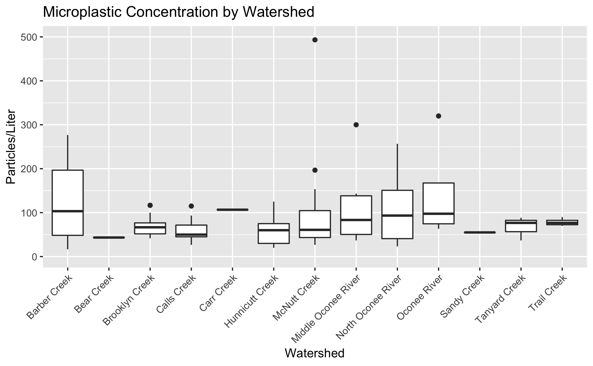
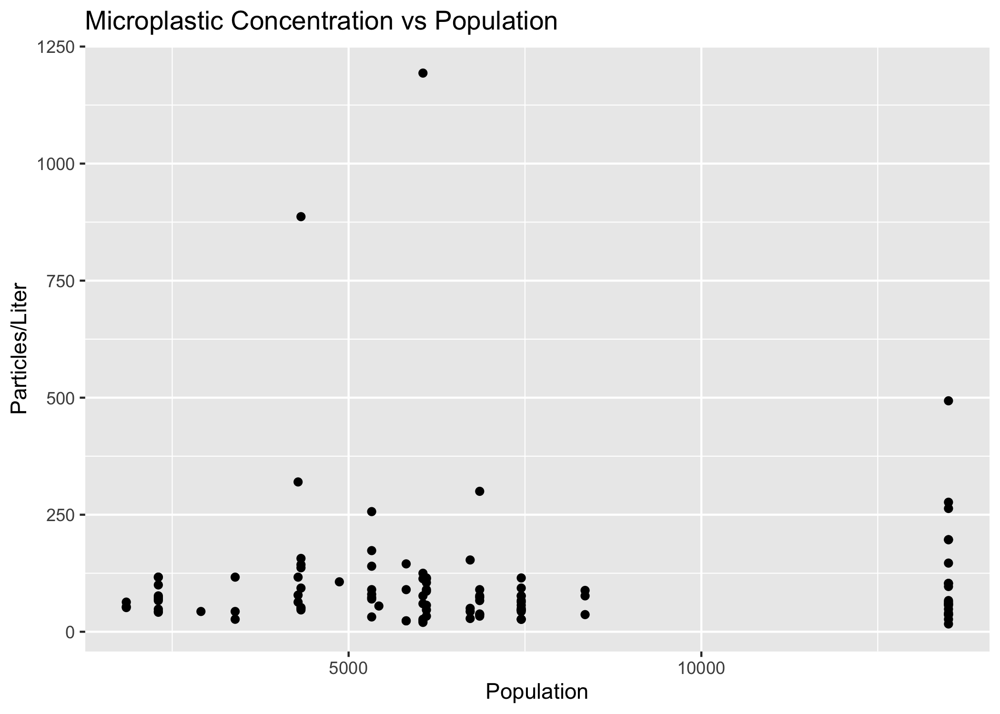
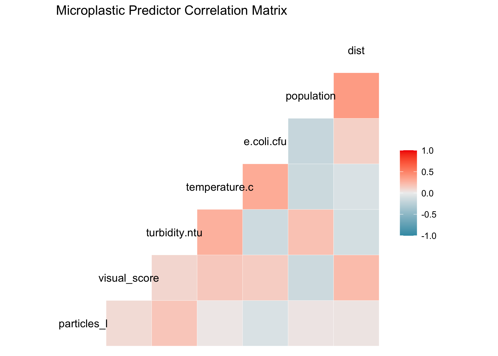
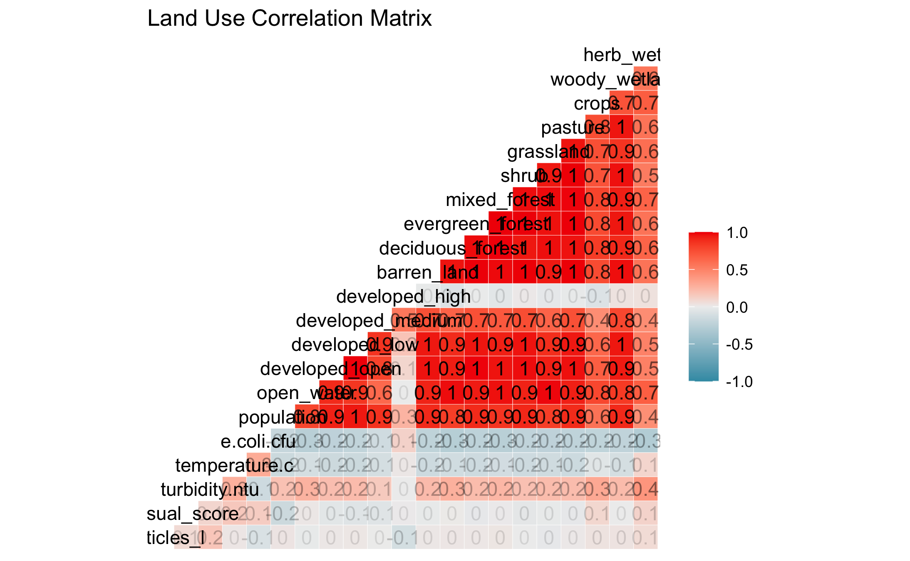
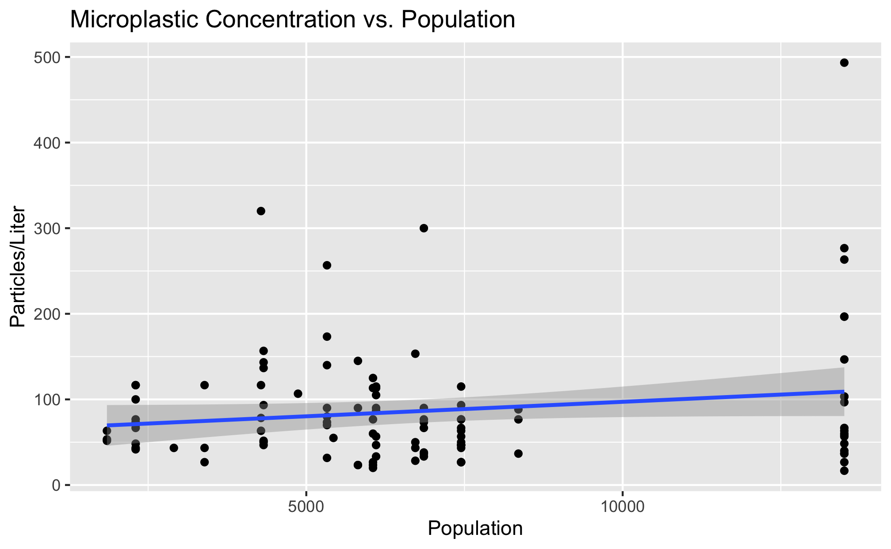

## Exploratory analysis

This section will contain the key products of my exploratory analysis (located in exploration.Rmd) when complete. Since I am keeping this document in manuscript style, I will keep processing/exploration/analysis code separate. 

Table \@ref(tab:summarytable) shows a table summarizing the data.
```{r summarytable,  echo=FALSE}

#summarytable=readRDS("../../results/summarytable.rds")
#knitr::kable(summarytable, caption = 'Data summary table.')

#I eventually want a nice looking summary statistic table. This is a place holder for now  
```

### Distribution of Microplastic Concentration

Figure \@ref(fig:distribution) shows a histogram of microplastic concentration observations. The minimum concentration is 16.67 particles/L and the maximum is 1193.33 particles/L. The mean concentration is 104.39 particles/L, and the median is 66.67 particles/L. 

```{r distribution,  fig.cap='Distribution of Microplastic Concentration', echo=FALSE}
knitr::include_graphics("../../results/distribution.png")
```

Microplastic concentrations remained in similar ranges throughout the study period. Figure \@ref(fig:concentrationbydate) shows a boxplot of concentrations by sample date. 

```{r concentrationbydate,  fig.cap='Particles/L by Sample Date', echo=FALSE}
knitr::include_graphics("../../results/concentrationbydate.png")
```

There is some seasonal variation in concentration at each individual site. Figure \@ref(fig:seasonalconc-bysite) shows a plot of concentrations at each site. 

```{r seasonalconc-bysite,  fig.cap='Seasonal Variation in Particles/L', echo=FALSE}
knitr::include_graphics("../../results/seasonalconc_bysite.png")
```

There are similar microplastic levels throughout the watersheds within the Upper Oconee. Some watersheds experienced greater variation in microplastic levels than other watersheds. Figure \@ref(fig:conc-bywatershed) shows the microplastic concentrations by watershed. 

```{r conc-bywatershed,  fig.cap='Watershed Microplastic Concentrations', echo=FALSE}

```

Figure \@ref(fig:watershed-overtime) shows a line graph of the mean watershed microplastic concentrations at each seasonal sampling date. 

```{r watershed-overtime,  fig.cap='Microplastic Concentration Over Time', echo=FALSE}
knitr::include_graphics("../../results/watershed_overtime.png")
```

### Predictors
Population, land cover/use, and bacteria levels are hypothesized predictors of microplastic concentration. Figure \@ref(fig:particlesvpop) and Figure \@ref(fig:logmpvcfu) demonstrate the relationship between microplastic concentration and population and microplastic concentration and bacteria levels (CFU/L), respectively. 

```{r particlesvpop,  fig.cap="Particles/L vs Population", echo=FALSE}

```

```{r logmpvcfu,  fig.cap='Log particles/L vs CFU', echo=FALSE}
knitr::include_graphics("../../results/logmpvcfu.png")
```

Figure \@ref(fig:matrix) and Figure \@ref(fig:landmatrix) show correlation matrices for the hypothesized predictor and for the different categories of land use. 

```{r matrix,  fig.cap='Predictor matrix', echo=FALSE}

```

```{r landmatrix,  fig.cap='Land cover matrix', echo=FALSE}

```

## Full analysis

Preliminary modeling reveals that there is not a strong relationship between microplastic concentration and population level. Figure \@ref(fig:m-concvpop-no-outlier) demonstrates a linear model fit. 

```{r m-concvpop-no-outlier,  fig.cap='Concentration vs Population Linear Model', echo=FALSE}

```

Figure \@ref(fig:m-logconcvcfu) shows a linear model of microplastic concentration vs CFU (both variables log-transformed). 

```{r m-logconcvcfu,  fig.cap='Concentration vs CFU Linear Model', echo=FALSE}
knitr::include_graphics("../../results/m_logconcvcfu.png")
```

Figure \@ref(fig:concvturbidity) demonstrates a linear model of particles/L vs turbidity.

```{r m_concvturbidity,  fig.cap='Concentration vs Turbidity Linear Model', echo=FALSE}
knitr::include_graphics("../../results/m_concvturbidity.png")
```

Table \@ref(tab:lmfittable) shows a table summarizing a linear model fit predicting particles/L with 6 predictors. 

```{r lmfittable,  echo=FALSE}
lm_fit_table=readRDS("../../results/lm_fit_table.rds")
knitr::kable(lm_fit_table, caption = 'Linear model fit table.')
```


