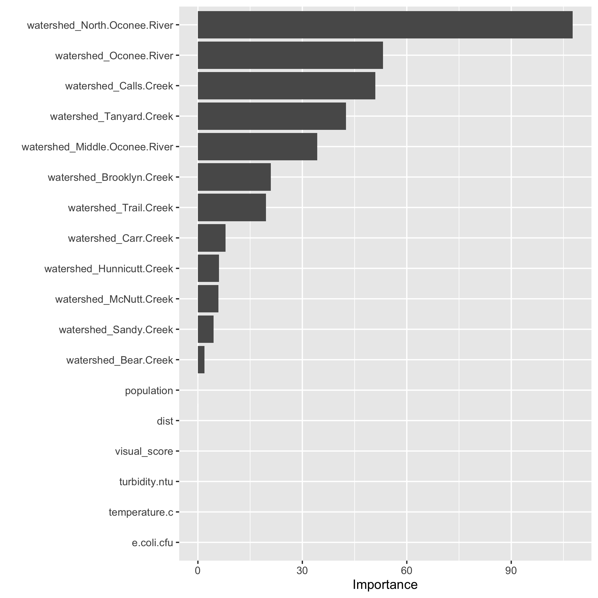

# Documentation for Supplementary Files
Code and data files required to reproduce this analysis are available on [GitHub](https://github.com/ameliafoley/AmeliaFoley-MADA-project)

* "**AmeliaFoley-MADA-project.Rproj**" Establishes relative file paths
* "**README.md**" Provides brief order of scripts for reproducing; summarizes project parts
* "**code**" folder contains all code for processing and analysis
  + "**analysis_code**"
    + analysis.Rmd performs linear regression on single predictors and full predictor sets
    + exploration.Rmd contains the exploratory data analysis
    + land_model.Rmd contains statistical models on land cover data
    + modeling.Rmd is the main analysis file containing final models (LASSO)
    + subset_modeling.Rmd is an additional analysis file performing models on subsets of data; it is not used for the manuscript
  + "**processing_code**"
    + processing_code.Rmd is the master script for all processing. It combines all of the scripts from below, which have been moved to the `ARCHIVE` folder. 
      + censusland_code.Rmd combines land cover data with microplastic data
      + censusprocessing.Rmd imports census tract population data
      + mpprocessing.R processes the original microplastic data file and saves cleaned data
      + uownprocessing.Rmd imports additional water quality data from UOWN.org
      + wrfprocessing.Rmd imports distance for nearest water reclamation facility
    + map_images.Rmd combines individual map images to produce a grid
  + "**readme.md**" provides an order and brief description of dependencies/outputs for processing code files
* "**data**" folder contains all raw and processed data
* "**products**" folder contains files to produce the Manuscript and Supplement
  + "**manuscript**" contains files for producing the manuscript
    + apa.csl optional format for citations
    + elsevier.csl optional format for citations
    + library.bib contains references
    + Manuscript.docx result of knitting the markdown
    + Manuscript.Rmd creates basic manuscript word document
    + style_template.docx placeholder to add special formatting to manuscript
    + Supplement.Rmd creates basic supplemental material word document
    + Supplement.docx result of knitting markdown file
* "**results**" folder contains all plots, tables, figures produced in data analysis

# Reproducing results
Reproducing this project requires R, RStudio, and Microsoft Word. Files should be run in the following order. 

In the code > processing_code folder:

1. processing_code.Rmd

In the code > analysis_code folder:

2. analysis.Rmd
3. modeling.Rmd
4. land_model.Rmd

In the code > processing_code folder:

5. map_images.Rmd

In the products folder

6. Manuscript.Rmd
7. Supplement.Rmd


# Supplementary results

### Distribution of Microplastic Concentration

Figure \@ref(fig:distribution) shows a histogram of microplastic concentration observations. The minimum concentration is 16.67 particles/L and the maximum is 1193.33 particles/L. The mean concentration is 104.39 particles/L, and the median is 66.67 particles/L. 

```{r distribution,  fig.cap='Distribution of Microplastic Concentration', echo=FALSE}
knitr::include_graphics("../../results/distribution.png")
```

Microplastic concentrations remained in similar ranges throughout the study period. Figure \@ref(fig:concentrationbydate) shows a boxplot of concentrations by sample date. 

```{r concentrationbydate,  fig.cap='Particles/L by Sample Date', echo=FALSE}
knitr::include_graphics("../../results/concentrationbydate.png")
```

There is some seasonal variation in concentration at each individual site. Figure \@ref(fig:seasonalconc-bysite) shows a plot of concentrations at each site. 

```{r seasonalconc-bysite,  fig.cap='Seasonal Variation in Particles/L', echo=FALSE}
knitr::include_graphics("../../results/seasonalconc_bysite.png")
```

There are similar microplastic levels throughout the watersheds within the Upper Oconee. Some watersheds experienced greater variation in microplastic levels than other watersheds. Figure \@ref(fig:conc-bywatershed) shows the microplastic concentrations by watershed. 

```{r conc-bywatershed,  fig.cap='Watershed Microplastic Concentrations', echo=FALSE}
knitr::include_graphics("../../results/conc_bywatershed.png")
```

Figure \@ref(fig:watershed-overtime) shows a line graph of the mean watershed microplastic concentrations at each seasonal sampling date. 

```{r watershed-overtime,  fig.cap='Microplastic Concentration Over Time', echo=FALSE}
knitr::include_graphics("../../results/watershed_overtime.png")
```

### Predictors
Population, land cover/use, and bacteria levels are hypothesized predictors of microplastic concentration. Figure \@ref(fig:particlesvpop) and Figure \@ref(fig:logmpvcfu) demonstrate the relationship between microplastic concentration and population and microplastic concentration and bacteria levels (CFU/100mL), respectively. 

```{r particlesvpop,  fig.cap="Particles/L vs Population", echo=FALSE}
knitr::include_graphics("../../results/particlesvpop.png")
```

```{r logmpvcfu,  fig.cap='Log particles/L vs CFU', echo=FALSE}
knitr::include_graphics("../../results/logmpvcfu.png")
```

Figure \@ref(fig:matrix) and Figure \@ref(fig:landmatrix) show correlation matrices for the hypothesized predictor and for the different categories of land use. 

```{r matrix,  fig.cap='Predictor matrix', echo=FALSE}
knitr::include_graphics("../../results/matrix.png")
```

```{r landmatrix,  fig.cap='Land cover matrix', echo=FALSE}
knitr::include_graphics("../../results/landmatrix.png")
```

## Full analysis

Preliminary modeling reveals that there is not a strong relationship between microplastic concentration and population level. Figure \@ref(fig:m-concvpop-no-outlier) demonstrates a linear model fit. 

```{r m-concvpop-no-outlier,  fig.cap='Concentration vs Population Linear Model', echo=FALSE}
knitr::include_graphics("../../results/m_concvpop_no_outlier.png")
```

Figure \@ref(fig:m-logconcvcfu) shows a linear model of microplastic concentration vs CFU (both variables log-transformed). 

```{r m-logconcvcfu,  fig.cap='Concentration vs CFU Linear Model', echo=FALSE}
knitr::include_graphics("../../results/m_logconcvcfu.png")
```

Figure \@ref(fig:m-concvturbidity) demonstrates a linear model of particles/L vs turbidity.

```{r m-concvturbidity,  fig.cap='Concentration vs Turbidity Linear Model', echo=FALSE}
knitr::include_graphics("../../results/m_concvturbidity.png")
```

Table \@ref(tab:lmfittable) shows a table summarizing a linear model fit predicting particles/L with 6 predictors. 

```{r lmfittable,  echo=FALSE}
lm_fit_table=readRDS("../../results/lm_fit_table.rds")
knitr::kable(lm_fit_table, caption = 'Linear model fit table.')
```

Beyond the basic linear model, we have applied additional methods to improve model performance, including LASSO regularization and building decision trees and random forests for model comparison. The predictions, outcomes, and residuals resulting from each type of plot are demonstrated in Figure \@ref(fig:model-grid)

```{r model-grid, fig.cap='Model Quality', echo=FALSE}
knitr::include_graphics("../../results/model_grid.png")
```

Based on the results of the three different models, the LASSO model is the best option for this dataset, though the minimal difference in RMSE when compared to the null model suggests that even though LASSO is the better model method compared to others, it still does not produce a great model for predicting microplastic concentration. 

Figure \@ref(fig:var-importance) demonstrates variable importance in the final selected LASSO model. None of the hypothesized predictors appear as important variables in this model. 

```{r var-importance, fig.cap='Variable importance', echo=FALSE}

```

